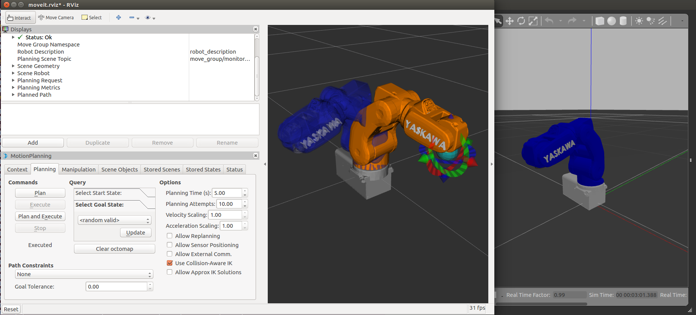

# motoman_motomini
[](https://travis-ci.org/RobinCPC/motoman_motomini)
[](https://opensource.org/licenses/BSD-3-Clause)


Packages for simulating Motoman Motomini in Gazebo and RViz

<a href="https://youtu.be/_nK1TvVzADs">
  
</a>  
Click the above picture to view demo in YouTube. 

## To simulate in Gazebo with MoveIt!
``` bash
roslaunch motoman_motomini_control simulate_with_moveit.launch
```

To send joint trajectory command by rqt topic publish (/yk/target_joint_data)
``` bash
rosrun motoman_motomini_control motomini_movegroup_control
```

## To receive real/fake joint valuse from NexCOBOT mqtt_monitor and simulate with Gazebo
This is customized for the AWS robomaker demo in iREX2019. Will need more instructions.
``` bash
roslaunch mqtt_monitor mqtt_yk_monitor.launch is_sim:=true
```


Note: motoman_motomini_support is cloned from ROS-Industrial [link](https://github.com/ros-industrial/motoman/tree/kinetic-devel/motoman_motomini_support), and I add Yaskawa logo on its forth joint (for demo purpose).
In addition, currently, this package only for simulation (I remove dependecy of `motoman_driver`).

